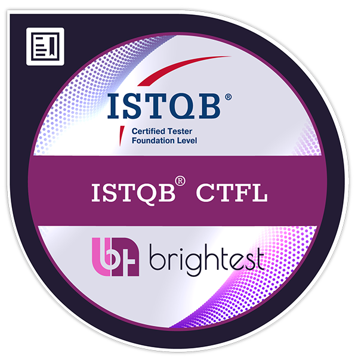
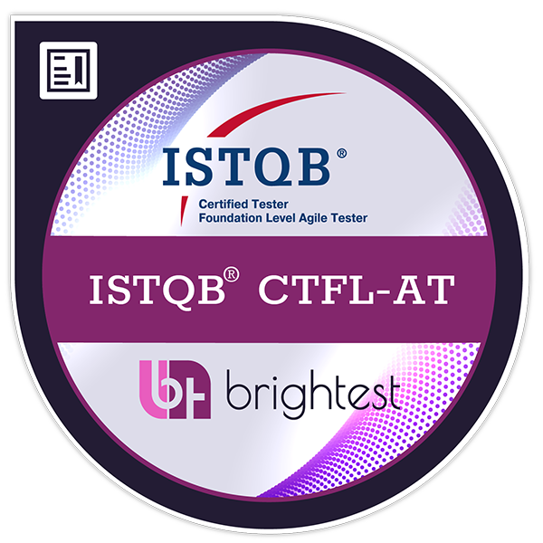

# Hi, I'm Diego 👋

## Software Quality Assurance Analyst and Full-stack Developer

### About me

I'm Diego, a Software Quality Assurance Analyst with a strong foundation in test engineering and a passion for technological innovation and software development.

Committed to excellence and industry best practices, I hold the international **ISTQB® CTFL (Certified Tester Foundation Level)** and **ISTQB® CTFL-AT (Agile Tester)** certifications.

My professional work focuses on ensuring the reliability, quality, and performance of digital products through:

- **Automated and manual testing:** Extensive experience designing and executing test scenarios with modern tools such as Cypress, Playwright, and Selenium for end-to-end (E2E) automation.
- **Prompt engineering and AI in QA:** Strategic use of Artificial Intelligence in my daily workflow to improve Spec-Driven Development implementations and create and manage skills and autonomous agents that accelerate the testing lifecycle.
- **Python and TypeScript full-stack development:** Development of complete solutions with Python, Flask, and TypeScript. My experience as a developer, gained through personal projects, AI studies, and freelance work, gives me a holistic view of the software lifecycle and helps me diagnose bugs and communicate effectively with engineering teams.

### Beyond the screen ☕

I'm passionate about coffee culture and practice the art of home barista. Just like technology, brewing the perfect coffee requires precision, patience, technique, and continuous improvement — principles I apply every day to software quality.

I'm always open to professional challenges, networking, and exchanging ideas about QA, test automation, AI, and, of course, a great cup of coffee.

## Certifications

- [ISTQB® CTFL](https://www.credly.com/badges/695a8467-83f3-43be-b0d5-d8a9ac6c1f4b/public_url) — Certified Tester Foundation Level
- [ISTQB® CTFL-AT](https://www.credly.com/badges/e58ff930-3f77-49bf-b82a-a72d0e93066f/public_url) — Agile Tester

  
  

## QA & Test Engineering

### Testing practices

`Test planning` · `Manual testing` · `Functional testing` · `Regression testing` · `API testing` · `E2E testing` · `BDD` · `Agile/Scrum`

### Test automation

  
  
  
  
  

`Cypress` · `Playwright` · `Selenium` · `Pytest` · `Vitest`

### AI applied to QA

`Prompt engineering` · `Spec-Driven Development` · `AI-assisted testing` · `Autonomous agents`

## Software Development

### Python

  
  
  
  

`Python` · `Flask` · `FastAPI` · `Jinja` · `REST APIs`

### JavaScript and TypeScript

  
  
  
  
  
  
  
  
  
  

`Node.js` · `JavaScript` · `TypeScript` · `Express 5` · `React 19` · `React Router` · `Vite` · `JWT` · `Zod` · `Lucide React`

### HTML and CSS

  
  

`HTML5` · `CSS3`

### Databases and data access

  
  
  
  
  
  
  
  

`MongoDB` · `Mongoose` · `Prisma` · `PostgreSQL` · `MySQL` · `SQLite` · `SQLAlchemy` · `Microsoft SQL Server`

Recently used in a project: Prisma alongside MongoDB/Mongoose for data modeling and persistence.

### Tools and workflow

  
  
  

`Git` · `GitHub` · `Visual Studio Code`

## What I bring to a team

- A quality-first mindset throughout the software development lifecycle.
- Experience connecting manual testing, automation, API validation, and exploratory testing.
- A developer's perspective for investigating defects and collaborating with engineering teams.
- Practical use of AI to improve productivity, documentation, and test strategy.
- Continuous learning guided by measurable improvement and sound engineering practices.

## Let's connect

- [LinkedIn](https://www.linkedin.com/in/diegosaltori)
- [YouTube](https://www.youtube.com/@diego.saltori)
- [Instagram](https://instagram.com/diego.saltori)
- [Email](mailto:dgarcia.saltori@gmail.com)
